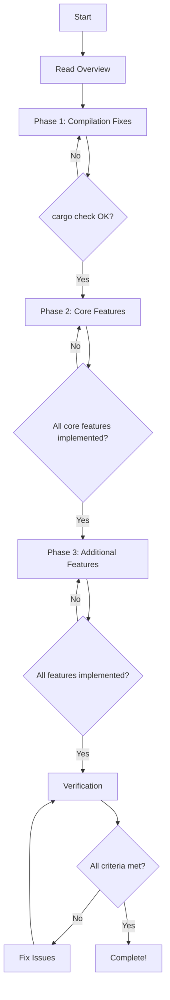

# TradeBias AI - Project Plan

This directory contains a comprehensive project plan to fix all compilation errors and complete all missing features in the TradeBias AI codebase.

## 📋 Current Project Status

- **Build Status**: ❌ Does not compile (50+ errors)
- **Implementation**: ~70% structurally complete, needs fixes and missing features
- **Blockers**: Trait conflicts, type mismatches, Polars API issues, missing configuration system

## 📚 Plan Documents

### Core Planning Documents

1. **[00-overview.md](./00-overview.md)** - Start here
   - Project status summary
   - Plan structure overview
   - Success criteria
   - Estimated scope

2. **[01-phase1-compilation-fixes.md](./01-phase1-compilation-fixes.md)** - Critical (35 tasks)
   - Fix all 50+ compilation errors
   - Resolve trait architecture conflicts
   - Fix Polars API compatibility
   - Goal: Achieve `cargo build` success

3. **[02-phase2-core-features.md](./02-phase2-core-features.md)** - High Priority (45 tasks)
   - Implement configuration system (completely missing)
   - Fix Polars DSL issues in indicators
   - Complete partial implementations
   - Goal: All core features functional

4. **[03-phase3-additional-features.md](./03-phase3-additional-features.md)** - Medium Priority (60+ tasks)
   - Implement 20 Tier 2 indicators
   - Complete data connector framework
   - Implement ML signal/filtering engines
   - Goal: 100% feature completeness

### Reference Documents

5. **[04-quick-reference-checklist.md](./04-quick-reference-checklist.md)**
   - Condensed checklist of all ~140 tasks
   - Progress tracking template
   - Task-by-task completion tracking

6. **[05-implementation-guide.md](./05-implementation-guide.md)**
   - Detailed instructions for AI agents
   - Code style guidelines
   - Common pitfalls and solutions
   - Verification strategies

## 🎯 Quick Start

### For Human Project Managers

1. Read `00-overview.md` to understand the plan structure
2. Review `04-quick-reference-checklist.md` for task breakdown
3. Assign phases to AI agents or developers
4. Track progress using the checklist

### For AI Agents

1. Read `05-implementation-guide.md` thoroughly
2. Start with Phase 1 tasks in sequential order
3. Follow the code templates and patterns exactly
4. Mark tasks complete in `04-quick-reference-checklist.md`
5. **Do NOT run tests** - only implement code changes

### For Developers

1. Review current errors in `docs/errors.md`
2. Check implementation status in `docs/implementation_summary.md`
3. Pick a phase based on priority
4. Follow the detailed task instructions
5. Verify with `cargo check` after each phase

## 📊 Project Metrics

### Scope
- **Total Tasks**: ~140 specific code changes
- **Total Files**: ~50 files to create/modify
- **New Code**: ~3,000-4,000 lines estimated
- **Timeline**: 3-5 days for experienced Rust developer

### Task Distribution
```
Phase 1: Critical Fixes      35 tasks (25%)  ████████░░░░░░░░
Phase 2: Core Features        45 tasks (32%)  ██████████░░░░░░
Phase 3: Additional Features  60 tasks (43%)  █████████████░░░
```

### Priority Breakdown
```
Critical (Phase 1)  ████████████████████████████████  100% must-do
High (Phase 2)      ████████████████████████░░░░░░░░   80% must-do
Medium (Phase 3)    ████████████░░░░░░░░░░░░░░░░░░░░   40% must-do
```

## 🔍 Key Architectural Decisions

### Decision 1: Trait Architecture (Phase 1, Task 4.1)
**Problem**: Conflicting blanket trait implementations
**Solution**: Use enum-based `StrategyFunction` instead of trait inheritance
**Impact**: Affects registry, semantic mapper, and all function access patterns

### Decision 2: AST Representation (Phase 1, Task 5.1)
**Problem**: Inconsistent use of `StrategyAST` vs `AstNode`
**Recommended**: Have `StrategyAST` wrap `AstNode` with metadata
**Impact**: Affects backtester, evolution engine, and all AST consumers

### Decision 3: Polars Version (Phase 1, Task 3.1)
**Problem**: Missing methods suggest version mismatch
**Recommended**: Update to Polars 0.36+ with full features
**Impact**: Affects all indicator implementations

### Decision 4: Configuration Architecture (Phase 2, Task 1)
**Problem**: System completely missing
**Solution**: Implement trait-based config sections with TOML serialization
**Impact**: Enables runtime configuration without recompilation

## 🚨 Critical Blockers

These must be resolved in Phase 1 before any other work:

1. **Trait Conflicts** (Task 4.1) - Prevents compilation
2. **AST Type Mismatch** (Task 5.1) - Prevents backtester from working
3. **Polars API Issues** (Tasks 3.1-3.2) - Prevents indicators from working
4. **Import Errors** (Tasks 1.1-1.7) - Prevents many files from compiling

## ✅ Success Criteria

### Phase 1 Success
- [ ] `cargo check` returns 0 errors
- [ ] All import paths resolve correctly
- [ ] Trait architecture compiles without conflicts
- [ ] Polars methods are accessible
- [ ] Type system is consistent

### Phase 2 Success
- [ ] Configuration system fully implemented
- [ ] Can load/save config from TOML files
- [ ] All Polars DSL calls work correctly
- [ ] All core features functional
- [ ] `cargo build` still succeeds

### Phase 3 Success
- [ ] All 20 Tier 2 indicators working
- [ ] CSV data connector functional
- [ ] ML signal framework implemented
- [ ] All specs in `docs/ai-implementation/` marked complete
- [ ] Project ready for testing phase

### Final Success
- [ ] All phases complete
- [ ] `cargo build --release` succeeds
- [ ] All items in `implementation_summary.md` marked "Implemented"
- [ ] No TODO comments in critical paths
- [ ] Code ready for `cargo test` (but don't run yet)

## 📖 Related Documentation

- `docs/implementation_summary.md` - Current implementation status
- `docs/errors.md` - Current compilation errors
- `docs/ai-implementation/*.md` - Feature specifications (19 files)
- `Cargo.toml` - Dependencies and project configuration

## 🔄 Execution Workflow



## 💡 Tips for Success

1. **Follow the Order**: Phases are sequenced to minimize rework
2. **One Phase at a Time**: Don't skip ahead or mix phases
3. **Verify Often**: Run `cargo check` after each major change
4. **Document Assumptions**: Add comments when making design choices
5. **Use Templates**: Follow the code templates in the plan documents
6. **Don't Test Yet**: Focus purely on implementation, testing comes later

## 📞 Getting Help

If you encounter issues not covered in the plan:

1. Check `docs/errors.md` for current error state
2. Review the relevant `docs/ai-implementation/*.md` spec
3. Look for similar patterns in existing code
4. Document the issue and make a reasonable assumption
5. Use `todo!()` macro for complex logic to be filled later

## 🎓 Learning Resources

For understanding the codebase:
- **Polars**: https://pola-rs.github.io/polars/
- **Rust Traits**: https://doc.rust-lang.org/book/ch10-02-traits.html
- **Genetic Programming**: See `docs/ai-implementation/11-evolution-engine.md`
- **Meta-Labeling**: See `docs/ai-implementation/15-ml-meta-labeling.md`

## 📝 License

Same as main project.

---

**Last Updated**: 2025-11-12
**Plan Version**: 1.0
**Status**: Ready for implementation
